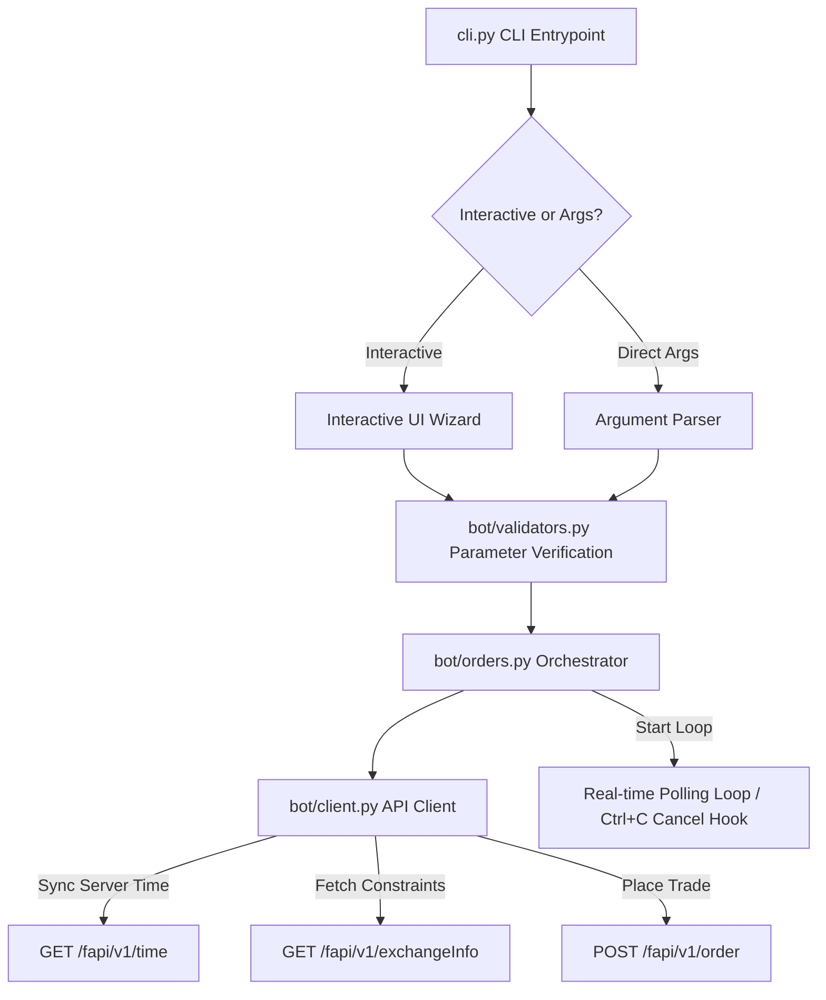

# ⚡ Binance Futures Testnet Trading Bot

<p align="center">
  
  
  
</p>

An advanced, production-ready Python trading bot designed to place and manage orders on the **Binance Futures Testnet (USDT-M)**. Features client-side validation filters, real-time time synchronization, auto-precision rounding, and a highly polished interactive CLI terminal cockpit.

---

## ✨ Key Features

- 📈 **Supported Orders**: Seamlessly place `MARKET`, `LIMIT`, and `STOP_MARKET` orders.
- 🔄 **Dual-Side Trading**: Fully supports both `BUY` (Long) and `SELL` (Short) sides.
- 🎯 **Smart Exchange-Filter Auto-Rounding**: Automatically queries `GET /fapi/v1/exchangeInfo` on startup to round quantity and price decimals to match the symbol's exact constraints (`LOT_SIZE` and `PRICE_FILTER`), eliminating API filter rejections.
- 📡 **Real-Time Order Tracking**: Option to poll order status every 2 seconds with an inline progress loader until the order is `FILLED`, `CANCELED`, or `EXPIRED`.
- 🛑 **Graceful Cancellation Hook**: Interrupting live tracking (`Ctrl+C`) prompts the user and allows them to instantly cancel the active resting order on the exchange.
- ⏰ **Drift Protection**: Automatically fetches Binance server time to calculate and adjust for local clock drift, eliminating `recvWindow` signature errors.
- 📝 **Dual-Destination Logging**:
  - **Console**: Clean, colorized status banners (`[SUCCESS]`, `[ERROR]`, `[INFO]`).
  - **File (`trading_bot.log`)**: Full traceback logs with query payloads, headers, signed signatures, and raw JSON responses.

---

## 🛠️ Quick Start

### 1. Prerequisites
Make sure you have Python 3.8+ installed.

### 2. Install Dependencies
Clone the repository and install requirements:
```bash
pip install -r requirements.txt
```

### 3. Configure API Credentials
Create a `.env` file in the project root:
```bash
copy .env.example .env
```
Fill in your credentials from the [Binance Futures Testnet](https://testnet.binancefuture.com) dashboard:
```env
BINANCE_API_KEY=your_testnet_api_key_here
BINANCE_API_SECRET=your_testnet_api_secret_here
```

> [!TIP]
> **No Credentials? Use Simulation Mode!**
> If you leave `BINANCE_API_KEY=MOCK` and `BINANCE_API_SECRET=MOCK` in `.env`, the bot will automatically enter **Simulation Mode**—generating realistic mocked responses and tracking loops completely locally.

---

## 🚀 Usage Guide

The application supports both a guided interactive terminal menu and direct command-line execution flags.

### 1. Interactive Cockpit (Recommended)
Simply launch the bot without any parameters:
```bash
python cli.py
```
This guides you step-by-step through choosing the symbol, side, type, quantity, and price with real-time input validations and confirmation cards.

---

### 2. Direct CLI Commands
You can run trades directly by passing flags:

| Flag | Short | Type | Description |
| :--- | :--- | :--- | :--- |
| `--symbol` | `-s` | String | Alphanumeric symbol (e.g. `BTCUSDT`) |
| `--side` | `-d` | Choices | Order side (`BUY`, `SELL`) |
| `--type` | `-t` | Choices | Order type (`MARKET`, `LIMIT`, `STOP_MARKET`) |
| `--qty` | `-q` | Float | Quantity (Auto-rounded to exchange step size) |
| `--price` | `-p` | Float | Limit price (Auto-rounded, required for `LIMIT`) |
| `--stop-price` | `-sp`| Float | Stop trigger price (Required for `STOP_MARKET`) |
| `--track` | `-tr` | Flag | Enable real-time order tracking and polling |
| `--test-connection`| `-tc`| Flag | Verify API keys and synchronize server time |

#### Place a MARKET Order:
```bash
python cli.py --symbol BTCUSDT --side BUY --type MARKET --qty 0.001
```

#### Place a LIMIT Order with Live Tracking:
```bash
python cli.py --symbol BTCUSDT --side BUY --type LIMIT --qty 0.00123 --price 60000.125 --track
```

#### Place a STOP_MARKET Order (Bonus Type):
```bash
python cli.py --symbol BTCUSDT --side SELL --type STOP_MARKET --qty 0.002 --stop-price 59500
```

---

## 📐 Architecture & Design Decisions



1. **Direct REST Integration**: Uses raw `requests` calls for fine-grained control over payload signatures and to bypass external library maintenance issues.
2. **Auto-Rounding Step quantizer**: Financial calculations use Python's `decimal` module to prevent float approximation errors when formatting order strings for the exchange filters.
3. **Double Logging Isolation**: Kept standard outputs clean and pretty while capturing full API payloads (masking API keys for security) in the debug log file.